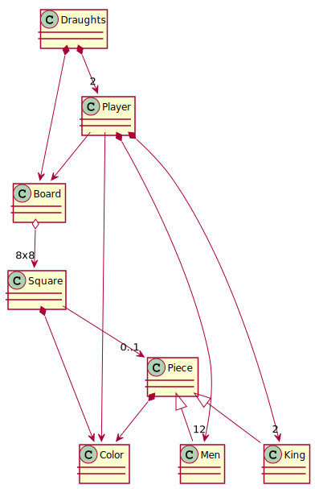

# P3: Damas - Javier Diaz Lopez (parte 1: Pruebas unitarias sin dobles)

  * ## Anotaciones alumno: 
  > Para realizar los tests de la práctica se ha empezado la implementación partiendo del codigo proporcionado por el profesor "solution.Java". 

## Modelo del Dominio
Como jugar: https://www.youtube.com/watch?v=yFrAN-LFZRU

### Instrucciones de entrega

Entrega de un proyecto público en git varias ramas:

* **master**, con:
    * Modelo del dominio.
    * Instrucciones de entrega.
    * Requisitos: Puedes encontrar los requisitos en la carpeta /Damas de este mismo repositorio.
* **unitTestWithoutDoubles**, con:
    * solución en Java o similar (fuertemente tipado) basada en el capitulo de Diseño y el proyecto ticTacToe
        * Modelo del Dominio: https://github.com/ijavidilo/p3-damas/tree/master#modelo-del-dominio
        * Implementación: https://github.com/ijavidilo/p3-damas/tree/unitTestWithoutDoubles/solution.Java/src/main/java/usantatecla/draughts
        * Test unitarios: https://github.com/ijavidilo/p3-damas/tree/unitTestWithoutDoubles/solution.Java/src/test/java/usantatecla/draughts
* **unitTestWithMockito**, con:
    * solución en Java o similar (fuertemente tipado) basada en el capitulo de Diseño y el proyecto ticTacToe
        * Modelo del Dominio: https://github.com/ijavidilo/p3-damas/tree/master#modelo-del-dominio
        * Implementación: https://github.com/ijavidilo/p3-damas/tree/unitTestWithMockito/solution.Java/src/main/java/usantatecla/draughts
        * Test unitarios: https://github.com/ijavidilo/p3-damas/tree/unitTestWithMockito/solution.Java/src/test/java/usantatecla/draughts        

Master Cloud Apps curso 2020/21 [MasterCloudApps](https://www.codeurjc.es/mastercloudapps/).